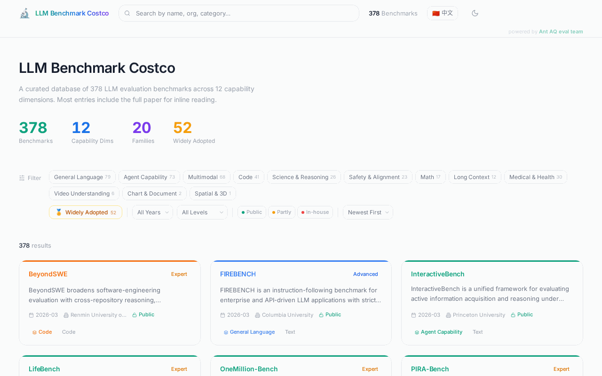

# LLM Benchmark Costco 🛒

[](https://github.com/joe1chief/llm-benchmark-costco/stargazers)
[](https://github.com/joe1chief/llm-benchmark-costco/network/members)
[](LICENSE)
[](https://github.com/joe1chief/llm-benchmark-costco/commits/main)
[](https://joe1chief.github.io/llm-benchmark-costco/)
[](https://joe1chief.github.io/llm-benchmark-costco/)

> A curated, searchable database of **378 LLM evaluation benchmarks** across 12 capability dimensions — with inline PDF reading, Mermaid build flowcharts, bilingual UI, and dark mode.

**[🌐 Live Demo](https://joe1chief.github.io/llm-benchmark-costco/)** · **[📊 Browse Benchmarks](https://joe1chief.github.io/llm-benchmark-costco/)** · **[🤝 Contribute](CONTRIBUTING.md)**

---



---

## Why LLM Benchmark Costco?

| Feature | Costco | PapersWithCode | HuggingFace Datasets | arXiv Search |
|---------|--------|---------------|---------------------|-------------|
| Curated LLM benchmarks only | ✅ | ❌ (all ML) | ❌ (all datasets) | ❌ |
| Inline PDF reading | ✅ | ❌ | ❌ | ❌ |
| Build process flowcharts | ✅ | ❌ | ❌ | ❌ |
| Multi-dim filtering (year/difficulty/openness) | ✅ | Partial | Partial | ❌ |
| Bilingual (EN/ZH) | ✅ | ❌ | ❌ | ❌ |
| Related benchmarks & family lineage | ✅ | ❌ | ❌ | ❌ |
| Dark mode | ✅ | ❌ | ❌ | ❌ |

## Features

**378 Benchmarks** across 12 capability dimensions — Agent Capability (73), General Language (79), Multimodal (68), Code (41), Science & Reasoning (26), Safety & Alignment (23), Medical & Health (30), and more.

**Inline PDF Reading** — Click any card to open the details drawer and read the full paper without leaving the page. Most entries embed the original arXiv PDF directly.

**Build Process Flowcharts** — Over 200 benchmarks include Mermaid-rendered diagrams explaining exactly how the dataset was constructed. Now with **fullscreen mode** for complex flowcharts.

**Powerful Filtering** — Filter by L1 capability category, year (including 2025/2026 latest), difficulty level (Basic → Frontier), and data openness (Public / Partly / In-house).

**Family & Lineage** — Explore benchmark families (e.g., MMLU, GAIA, SWE-bench) and related benchmarks to understand the evaluation landscape.

**Bilingual UI** — Full English and Chinese interface with bilingual data fields.

## Quick Start

```bash
# Install dependencies
pnpm install

# Local development
pnpm dev

# Build for GitHub Pages
pnpm build:ghpages

# Deploy to gh-pages branch
npx gh-pages -d dist-ghpages
```

## Deployment

### GitHub Pages (Recommended)

1. Fork or clone this repository
2. Go to **Settings → Pages**
3. Set Source to **Deploy from a branch** → `gh-pages`
4. Run `pnpm build:ghpages && npx gh-pages -d dist-ghpages` to deploy

Access at: `https://<username>.github.io/llm-benchmark-costco/`

> **Sub-path configuration**: If deploying under a sub-path, set `base: '/your-repo-name/'` in `vite.ghpages.config.ts`.

## Updating Benchmark Data

The data lives in `client/public/benchmarks.json`. Before updating, read [`skills/update-benchmarks/SKILL.md`](skills/update-benchmarks/SKILL.md) for the complete workflow covering type safety, null-value guards, and deployment steps.

## Tech Stack

| Layer | Technology |
|-------|-----------|
| Frontend | React 19 + TypeScript |
| Styling | Tailwind CSS 4 |
| Build | Vite 7 |
| Routing | Wouter |
| Icons | Lucide React |
| Diagrams | Mermaid |
| Deployment | GitHub Pages via `gh-pages` |

## Project Structure

```
llm-benchmark-costco/
├── client/
│   ├── public/
│   │   └── benchmarks.json          # 378 benchmark entries
│   └── src/
│       ├── components/
│       │   ├── BenchmarkCard.tsx     # Card component
│       │   ├── BenchmarkDrawer.tsx   # Detail drawer + PDF + flowchart
│       │   ├── FilterBar.tsx         # Filter controls
│       │   ├── HeroStats.tsx         # Stats banner
│       │   └── Navbar.tsx            # Top navigation
│       ├── contexts/
│       │   └── LangContext.tsx       # i18n (EN/ZH)
│       ├── hooks/
│       │   └── useBenchmarks.ts      # Data loading & filtering
│       ├── pages/
│       │   └── Home.tsx              # Main page
│       └── types/
│           └── benchmark.ts          # TypeScript types
├── skills/
│   └── update-benchmarks/
│       └── SKILL.md                  # Data update playbook
├── vite.ghpages.config.ts            # GitHub Pages build config
└── README.md
```

## Contributing

We welcome contributions! The easiest way to contribute is to submit a new benchmark via [GitHub Issues](https://github.com/joe1chief/llm-benchmark-costco/issues/new/choose) using the **Submit New Benchmark** template — no coding required.

For code contributions, please read [CONTRIBUTING.md](CONTRIBUTING.md).

## Contributors

[](https://github.com/joe1chief/llm-benchmark-costco/graphs/contributors)

## License

MIT
